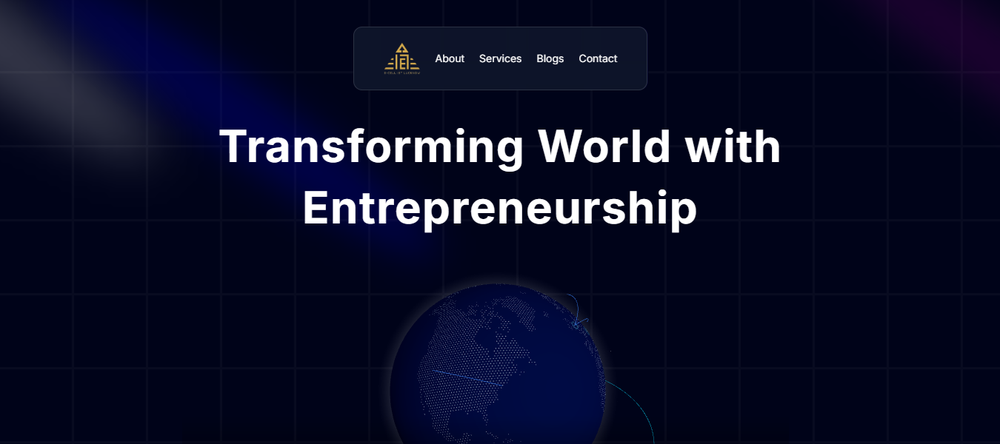
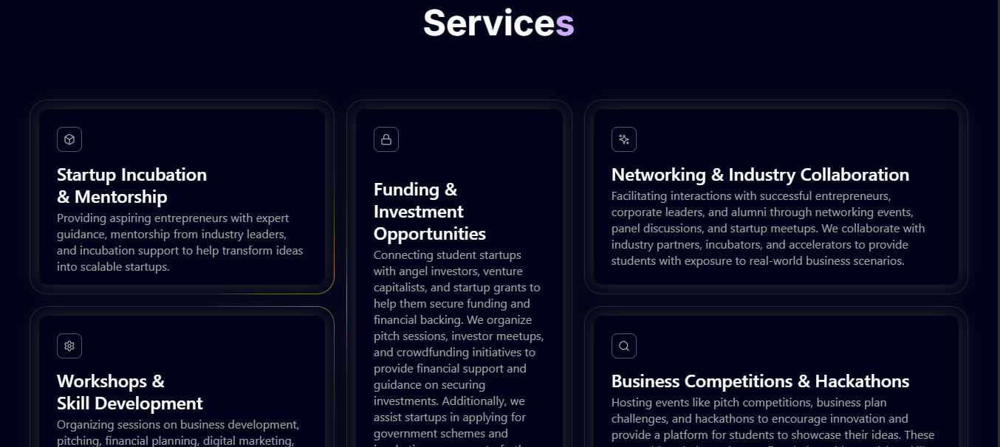
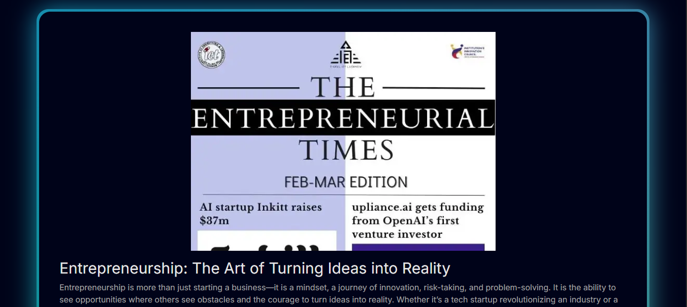
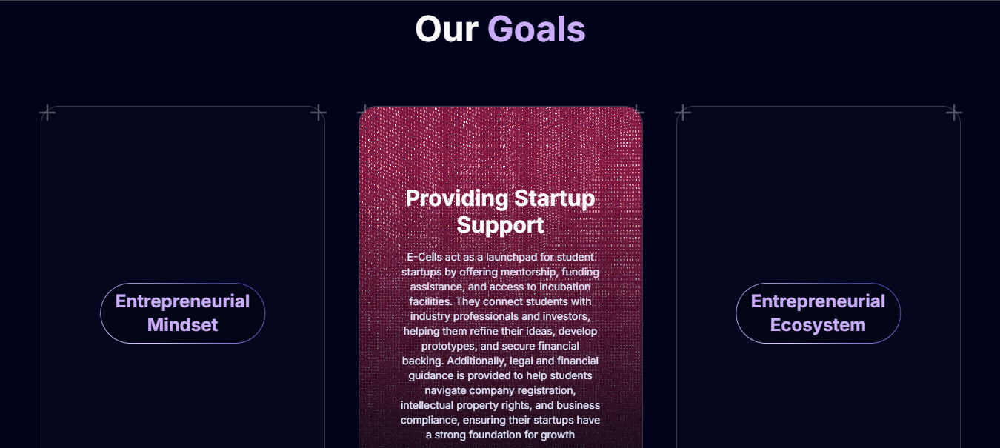

# 🚀 E-Cell IET Lucknow Website

Welcome to the official repository for the **Entrepreneurship Cell (E-Cell)** website of **IET Lucknow**!  
This website serves as the digital front for showcasing events, initiatives, and resources aimed at nurturing entrepreneurial spirit among students.

## 🌐 Live Website

[Visit the Website](https://e-cell-iet-lko.vercel.app/)

## 📸 Screenshots

<!-- Add screenshots of your site here -->
<p float="left">
  
  
  
  
</p>

## 🛠️ Tech Stack

- **Frontend:** HTML, CSS, JavaScript , React , Next.js
- **Backend:** Node.js
- **Hosting:** Vercel 

## 📁 Project Structure

```
ecell-website/
│
├── public/              # Static assets
├── src/                 # Main source code
│   ├── components/      # Reusable components
│   └── styles/          # CSS or Tailwind styles
│
├── .gitignore
├── package.json
└── README.md
```

## 📌 Features

- Dynamic homepage with upcoming events and announcements  
- Events section with past and upcoming event details    
- Responsive design for all screen sizes  
- Integrated social links
- Blogs section for entrepreneurial blogs.
- Services section for details regarding services provided by E-cell.
- Mentor's message.

## 🚀 Getting Started

### Prerequisites

- Node.js and npm installed

### Installation

```bash
git clone https://github.com/your-username/ecell-website.git
cd ecell-website
npm install
npm run dev
```

Open `http://localhost:3000` to view it in the browser.

## 🤝 Contributing

I welcome contributions! Please open an issue to discuss what you would like to change.  
You can also fork the repository, make changes, and create a pull request.

## 🧑‍💻 Contributors

- [Shivansh Kaushik](https://github.com/your-username)


Made by the Shivansh Kaushik @ IET Lucknow
