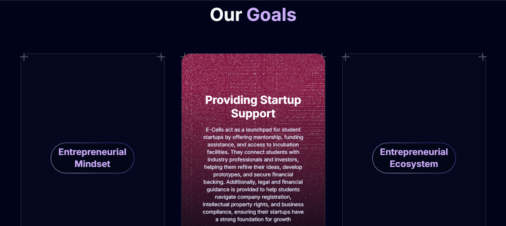

# 🚀 E-Cell IET Lucknow Website

A modern, high-performance website for the Entrepreneurship Cell of IET Lucknow, built with cutting-edge web technologies.


## 🌐 Live Website

[Visit the Website](https://e-cell-iet-lko.vercel.app/)

## 📸 Screenshots

<!-- Add screenshots of your site here -->
<p float="left">
  
  
  
  
</p>

## 🛠️ Tech Stack

- **Frontend:** HTML, CSS, JavaScript , React , Next.js
- **Backend:** Node.js
- **Hosting:** Vercel

## 📁 Project Structure

```
ecell-website/
│
├── public/              # Static assets
├── src/                 # Main source code
│   ├── components/      # Reusable components
│   └── styles/          # CSS or Tailwind styles
│
├── .gitignore
├── package.json
└── README.md
```

## 📌 Features

- Dynamic homepage with upcoming events and announcements
- Events section with past and upcoming event details
- Responsive design for all screen sizes
- Integrated social links
- Blogs section for entrepreneurial blogs.
- Services section for details regarding services provided by E-cell.
- Mentor's message.

## 🚀 Getting Started

### Prerequisites

- Node.js and npm installed

### Installation

```bash
git clone https://github.com/your-username/ecell-website.git
cd ecell-website
npm install
npm run dev
```

Open `http://localhost:3000` to view it in the browser.

## 📊 Error Monitoring & Analytics

This project uses **Sentry** for comprehensive error monitoring and performance tracking:

### Sentry Configuration

- **Automatic Source Map Upload**: Source maps are automatically uploaded during production builds via the Sentry Next.js plugin (`withSentryConfig`)
- **Error Boundaries**: Comprehensive error boundaries throughout the application
- **Performance Monitoring**: Real-time performance metrics and Core Web Vitals tracking
- **Environment Support**: Configured for development, staging, and production environments

### Environment Variables

Create a `.env.local` file with the following Sentry configuration:

```bash
# Sentry Configuration
SENTRY_ORG=your-sentry-org
SENTRY_PROJECT=your-sentry-project
SENTRY_AUTH_TOKEN=your-sentry-auth-token
NEXT_PUBLIC_SENTRY_DSN=your-sentry-dsn

# Optional: Enable Sentry in development
SENTRY_ENABLED=true
```

### Source Maps

Source maps are automatically handled by the Sentry Next.js integration during `npm run build`. No manual upload scripts are needed.

## 🤝 Contributing

I welcome contributions! Please open an issue to discuss what you would like to change.  
You can also fork the repository, make changes, and create a pull request.

## 🧑‍💻 Contributors

- [Shivansh Kaushik](https://github.com/PhantomPhreak007)

Made by the Shivansh Kaushik @ IET Lucknow
